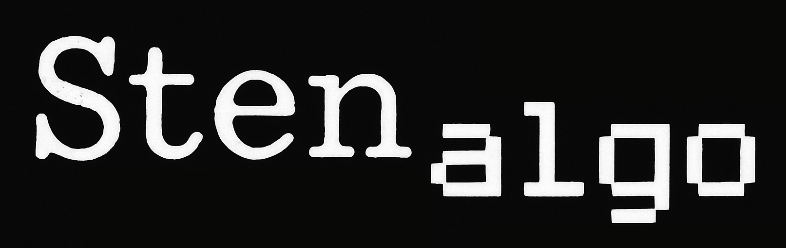

Stenotype keyboard layout and theory generator


## Objective

Using some optimization algorithms, evolve a stenograph keymap layout that minimize complexity of the theory for a given language. 

## Context

Stenograph keyboards present a limited keyset where multiple keys are pressed at the same time, forming a chord that represent
one or more phoneme / syllable in a word. Steno machines were once proprietary and expensive, but cheaper options are now available
through custom keyboards using popular mechanical keyboards parts and software or firmware interpreter. Those new keyboards are
programmable, so it is not needed to stick to the original century-old phoneme-keymap layout.

Visit the [Open Steno Project](https://openstenoproject.org) for an in depth introduction to the subject.

For hobbists, there is little added benefit to learning a traditional steno layout if better layouts can be generated. Steno keyboards
are not common and it is unlikely that one will need to use a steno keyboard that is not his own. 

This project aims at generating keymaps and theories for any keyboard layout (number and arrangement of key switches) based on some
keyboard constrains (prefered keys) and using a multi-dimensional optimization approach. 

## Introduction

Stenotyping is done on custom (minimal keys) keyboards. The user simultaneously presses multiple keys to form syllables or groups of syllables.
The fingers move as little as possible, but each can press multiple keys situated on the same column, or adjacent columns to the pinky or
index fingers.

Those keypresses (or chord) are interpreted by a software layer implementing a Theory. The theory translate the chord or group of chords into
one or multiple words.

The theory must closely match the syllable(s) pressed to the typed word(s), otherwise learning and remebering the corresponding keypress will
be difficult. It must also distinguish between words that have the same pronunciation, but different spellings (homophones). 

The best theory for a lexicon is as easy to learn and easy to use.

## Minimizing complexity

The algorithm will generate multiple keymap and theory pairs for a given keyboard layout, physiognomical constrains and lexicon. Those
keymap-theory will be scored based on the strain and complexity in the following ways :

### Finger strain 

The average number of keystroke must be minimized :
- Chords containing less keystrokes are preferable
- Words containing less Chords are preferable
- Common words should contain less strokes than rarely used words
- Movement of fingers should be minimized
- Pressing fewer keys per finger is preferable

### Mental strain

The mapping of keys to the sound they represent must be coherent :
- Phonemes must have a maximum of one canonical representation on the keyboard, one portion of a chord (todo: validate)
- Syllables must have the minimum number of chord representation (variations) on the keyboard to distinguish between the different spellings
- Rules (chord variations) to distinguish between spelling of a syllable must be consistent across a maximum of words sharing that syllable
- As much as possible, the order in wich phonemes are typed must match the order they occure in the syllable

Words that do not respect an established rule are deemed an exception
- The number of exceptions must be minimized

### Steps and progress
#### A suitable lexicon must be built. [x]
The French language Lexique version 383 was used as a base [[1]](#1) [[2]](#2). This lexicon version provides Word orthograph, phonology, 
Consonant-Vowel breakdow and phonological syllable breakdown (ex.: Manger - To eat, m@Ze, CV-CV, m@-Ze). Most importantly, it offers the 
words frequency extracted from 2 differnt corpus : Written French books and French movies subtitle.  It is however incomplete in regards to 
the grapheme (spelling) breakdown of syllable with only 2/3 of the words providing a breakdown allowing to map phonetic syllables to written 
syllables.

A second lexicon, LexiqueInfra [[3]](#3), was used to build graphem representations of the syllable (ex.: Manger, man-ger). This lexicon provides phoneme-grapheme 
associations for 137k of the 142k words of Lexique383. The final lexicon [`resources/LexiqueMixte.tsv`](resources/LexiqueMixte.tsv) was built by [`lexique.py`](lexique.py) and contains 
136,348 French words with corpus frequencies and both phoneme and grapheme syllable breakdowns. 


#### Phoneme and biphoneme frequencies must be extracted [x]
Typically, the order of the phonemes (from left to right) typed to form a chord must ressemble the order of the phonemes in the syllable.
Ordered biphoneme frequencies informs on the order the phonemes should be placed on the keymap. For this example, we assumed that the typical
order of the keys on the keymap would be the 3 groups of phonemes : Left-consonants -> Vowels -> Right-consonants.  In linquistic parlance, 
these phoneme groups are called the Onset, Nucleus and Coda components of a [syllable](https://en.wikipedia.org/wiki/Syllable#Grouping_of_components).

While pairs of phonemes (biphonemes) frequencies inform on the order of the phonemes, single-phoneme frequencies inform on the importance of the phoneme. 
Here is a representation of a phoneme order for all 3 groups of phonemes that minimize the frequency of chords where the phones are in the wrong order. 
Bar charts represent the frequency of the individual phonemes in each of the 3 groups.


##### Example of optimal phonemes order for the left hand (Onset), thumb vowels (Nucleus) and right hand (Coda)

```
Left hand optimization :

Best order (ordered score 91215.1, disordered score -1400.5):
 dksptSgNxvZmzfnblRwj

Left hand (syllable onset) consonant optimization :
┃                  R   ┃   ┃
┃                  R   ┃   ┃
┃                  R   ┃   ┃
┃     t            R   ┃   ┃
┃   spt            R   ┃   ┃
┃   spt      m     R   ┃   ┃
┃ dkspt    v m    lR   ┃   ┃
┃ dkspt    v m    lR j ┃   ┃
┃ dkspt    v m fnblR j ┃   ┃
┃ dksptSg  vZmzfnblRwj ┃   ┃
┃ dksptSgNxvZmzfnblRwj ┃ G ┃
┗━━━━━━━━━━━━━━━━━━━━━━╋━━━┛
               ordered ┃ floating 

Right hand optimization :

Best order (ordered score 15522.8, disordered score -5759.7):
 wjbpfvdsktgRlzNmnSZ

┃            R        ┃   ┃
┃            R        ┃   ┃
┃            R        ┃   ┃
┃            R        ┃   ┃
┃            R        ┃   ┃
┃            R        ┃   ┃
┃            R        ┃   ┃
┃        s t R        ┃   ┃
┃        s t Rl       ┃   ┃
┃  j    dskt Rl       ┃   ┃
┃ wjbpfvdsktgRlzNmnSZ ┃ G ┃
┗━━━━━━━━━━━━━━━━━━━━━╋━━━┛
              ordered ┃ floating 

Vowel optimization :

Best order (ordered score 6599.0, disordered score 0.0):
 8§i5ea9o2@OE

┃      a       ┃      ┃
┃      a       ┃      ┃
┃     ea       ┃      ┃
┃   i ea     E ┃      ┃
┃   i ea     E ┃      ┃
┃   i ea     E ┃      ┃
┃   i ea   @ E ┃      ┃
┃   i ea o @ E ┃      ┃
┃  §i ea o @ E ┃ °uy  ┃
┃  §i5ea o @OE ┃ °uy  ┃
┃ 8§i5ea9o2@OE ┃ °uy1 ┃
┗━━━━━━━━━━━━━━╋━━━━━━┛
       ordered ┃ floating 
```

Negative (disordered) score represent the sum of frequencies of biphonemes that would be in the wrong order. In the case of the right hand
consonants, the 25% disorded to 75% orderded ratio is mainly due to the "R" biphonemes where "R" can be before or after other consonant 
phonemes:
- "tR" frequency: 4110 (ex.: montre)
- "Rt" frequency: 1822 (ex.: forte)
- "dR" frequency: 2265 (ex.: tondre) 
- "Rd" frequency: 1339 (ex.: horde)

The algorithm choose the least penalizing option, placing "R" after "t" and "d".

There is not a single best order for phoneme arrangement. The final order offers some flexibility since some of the phonemes do not appear together in syllables. 
For example in the pairwise order preferences for the left hand phonemes shown below, the "v" phoneme line indicates that "v" can be placed in any position after 
the "k" and "s" phonemes and anywhere before the "l", "R", "w", "j" phonemes, indicated by the "<<" and ">>>>" symbols respectively.
```
   ↓↓             ↓↓↓↓
 ┃dksptSgNxvZmzfnblRwjG
━╋━━━━━━━━━━━━━━━━━━━━━
d┃=>>><=====>>=====>>>=
k┃<=>>><===><>>>>=>>>>=
s┃<<=>><>==>=>=>>>>>>>=
p┃<<<=><=======>>=>>>>=
t┃><<<=>>====>>><>>>>>=
S┃=>>><======>==>=>>>>=
g┃==<=<======>>=>=>>>>=
N┃==================>==
x┃==================>==
v┃=<<=============>>>>=  ←←
Z┃<>================>>=
m┃<<<=<<<=======>===>>=
z┃=<==<=<=========>>>>=
f┃=<<<<===========>>>>=
n┃=<<<><<====<===>>>>>=
b┃==<=<=========<=>>>>=
l┃=<<<<<<==<==<<<<==>>=
R┃<<<<<<<==<==<<<<==>>=
w┃<<<<<<<<<<<<<<<<<<===
j┃<<<<<<<==<<<<<<<<<===
G┃=====================
```

#### Physical keyboard representation must be used [x]
The file [`keyboard.py`](src/keyboard.py) provides a description of the [Starboard keyboard](https://www.stenograpy.store). The different
keypresses are assigned to fingers and penalty scores loosely corresponding to the strain they induce. Here is the Irland english keymap on the Starboard :

```
┏━━━━┳━━━━┳━━━━┳━━━━┳━━━━┳━━━━┓       ┏━━━━┳━━━━┳━━━━┳━━━━┳━━━━┳━━━━┓
┃    ┃ s  ┃ t  ┃ p  ┃ h  ┃    ┃       ┃    ┃ fv ┃ p  ┃ l  ┃ t  ┃ d  ┃
┣━━━━╋━━━━╋━━━━╋━━━━╋━━━━┫ *  ┃       ┃ *  ┣━━━━╋━━━━╋━━━━╋━━━━╋━━━━┫
┃    ┃ s  ┃ k  ┃ w  ┃ r  ┃    ┃       ┃    ┃ r  ┃ b  ┃ g  ┃ s  ┃ z  ┃
┗━━━━┻━━━━┻━━━━┻━━━━┻━━┳━┻━━┳━┻━━┓ ┏━━┻━┳━━┻━┳━━┻━━━━┻━━━━┻━━━━┻━━━━┛
                       ┃ a  ┃ o  ┃ ┃ e  ┃ u  ┃
                       ┗━━━━┻━━━━┛ ┗━━━━┻━━━━┛
Single keypress characters keymap
```

Some phonemes need more than a single keypress to be registered. For instance, here is the map of the phonemes requireing 2 keypresses to be registered.

```
┏━━━━┳━━━━┳━━━━┳━━━━┳━━━━┳━━━━┓       ┏━━━━┳━━━━┳━━━━┳━━━━┳━━━━┳━━━━┓
┃    ┃ f  ┃fxd ┃ bm ┃ ml ┃    ┃       ┃    ┃    ┃ nm ┃ m  ┃    ┃    ┃
┣━━━━╋━━━━╋━━━━╋━━━━╋━━━━┫    ┃       ┃    ┣━━━━╋━━━━╋━━━━╋━━━━╋━━━━┫
┃    ┃xqv ┃qdc ┃ b  ┃vcl ┃    ┃       ┃    ┃    ┃ nk ┃ k  ┃    ┃    ┃
┗━━━━┻━━━━┻━━━━┻━━━━┻━━┳━┻━━┳━┻━━┓ ┏━━┻━┳━━┻━┳━━┻━━━━┻━━━━┻━━━━┻━━━━┛
                       ┃    ┃    ┃ ┃ i  ┃ i  ┃
                       ┗━━━━┻━━━━┛ ┗━━━━┻━━━━┛
```

#### Mapping of the phonemes to the physical keys [ ]
This is the last step to obtain an optimal phonetic keyboard. The most popular keys must be easily accessible. Phonemes that require key combos
must not cause conflicts with other words that use the same keys to represent other phonemes.

#### Identifying homophones and define treatment rules [ ]
Typically, homophones have "alternative spelling" where extra phonemes or the * key are added to distinguish the different orthographical
spellings. A system must be devised to make the treatment of these exceptions so that it is intuitive

#### Treatment of verbs, prefixes, suffixes [ ]
French verbs have multiple conjugations suffixes per tense, some of which are homophones (je mange - m@Ze, tu manges - m@Ze). A system based 
on the function of the verb may simplify the selection of verb homophones.

Other common prefixes and suffixes should have consistent phoneme-keymap associations to reduce the cognitive load to learn exceptions.

## References
<a id="1">[1]</a> 
New, B., Pallier, C., Brysbaert, M., Ferrand, L. (2004) 
Lexique 2 : A New French Lexical Database.
Behavior Research Methods, Instruments, & Computers, 36 (3), 516-524.
[doi](https://doi.org/10.3758/BF03195598)

<a id="2">[2]</a> 
New, B., Brysbaert, M., Veronis, J., & Pallier, C. (2007). 
The use of film subtitles to estimate word frequencies. 
Applied Psycholinguistics, 28(4), 661-677.
[doi](https://doi.org/10.1017/S014271640707035X)

<a id="3">[3]</a> 
Gimenes, M., Perret, C., & New, B. (2020). 
Lexique-Infra: grapheme-phoneme, phoneme-grapheme regularity, consistency, 
and other sublexical statistics for 137,717 polysyllabic French words. 
Behavior Research Methods. 
[doi](https://doi.org/10.3758/s13428-020-01396-2)

