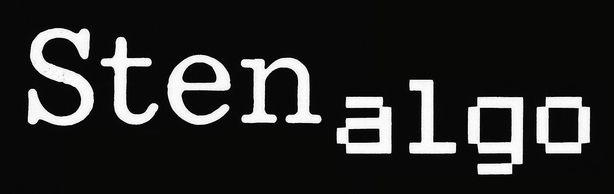

Stenotype keyboards offer a limited keyset where several keys are pressed at once, forming
a stroke; a software layer implementing a *theory* translates strokes into words. Cheap
programmable keyboards now exist, so a hobbyist has little reason to learn a century-old
layout if a better one can be generated ([Open Steno Project](https://openstenoproject.org)).
Stenalgo is such a generator for French, built with constraint programming (Google OR-Tools
CP-SAT) and targeting the 26-key Starboard keyboard: it generates the keymap and the
matching theory together, for a lexicon of 167,639 words merged from a 136,456-row mixed
lexicon built out of Lexique383 [[1]](#1) and LexiqueInfra [[3]](#3).

## Status
- **Layout mapped** — `starboard3h.json`, a committed working phoneme-to-key mapping (22 non-reserved keys).
- **Theory 1 built** — one phonetic stroke per syllable; homophones share one raw stroke sequence.
- **Same-lemma homophones done** — Homophone Groups (same lemma and category, `dors`/`dort`) get
  feature discriminating strokes from the elicited feature sets ([spec](docs/specs/discriminating-features.md)).
- **Different-lemma homophones done** — lemma-homophones (`ver`/`vert`/`verre`) get star/hash
  marks on the reserved keys ([spec](docs/specs/star-hash-marking.md)).
- **Not done yet** — dictionary densification (conjugation tables, prefixes) and the personal
  theory layer; see [ROADMAP.md](ROADMAP.md).

## Design goals
Minimize finger strain — keystrokes per stroke and per word, weighted per finger and key
position — and mental strain: phoneme-ordered strokes, few ambiguities and exceptions. Full
rationale and phoneme-order/keymap tables: [docs/ARCHITECTURE.md](docs/ARCHITECTURE.md).

## Optimized single-key phoneme keymap
Generated from `starboard3h.json` and may drift from it; the 2-keypress layer and the full
tables live in [docs/ARCHITECTURE.md](docs/ARCHITECTURE.md). Blank keys are reserved
(`*`/`#` carry the star/hash marks; 0/1 are held for a possible third mark).

```
┏━━━━━┳━━━━━┳━━━━━┳━━━━━┳━━━━━┳━━━━━┓         ┏━━━━━┳━━━━━┳━━━━━┳━━━━━┳━━━━━┳━━━━━┓
┃     ┃  k  ┃  p  ┃  m  ┃  R  ┃     ┃         ┃     ┃ jbw ┃  k  ┃  t  ┃  n  ┃ ZG  ┃
┣━━━━━╋━━━━━╋━━━━━╋━━━━━╋━━━━━┫     ┃         ┃     ┣━━━━━╋━━━━━╋━━━━━╋━━━━━╋━━━━━┫
┃     ┃  s  ┃  v  ┃  t  ┃ wNG ┃     ┃         ┃     ┃  s  ┃  d  ┃  R  ┃  l  ┃  m  ┃
┗━━━━━┻━━━━━┻━━━━━┻━━━━━┻━━━┳━┻━━━┳━┻━━━┓ ┏━━━┻━┳━━━┻━┳━━━┻━━━━━┻━━━━━┻━━━━━┻━━━━━┛
  ┃  1-key phonemes layer   ┃ @9  ┃  a  ┃ ┃  i  ┃ eO  ┃
  ┗━━                       ┗━━━━━┻━━━━━┛ ┗━━━━━┻━━━━━┛
```
## Quickstart
```bash
pip install -r requirements.txt             # install dependencies
# Prerequisites: Python 3.12+. Outputs: installed packages only.
pytest src/test/                            # run tests
# Prerequisites: dependencies. Outputs: console report only.
mypy src/                                   # type checking
# Prerequisites: dependencies. Outputs: console report only.

# The pipeline in dependency order, run from the repo root (prefix PYTHONHASHSEED=0 when
# the tracked outputs must be byte-reproducible); python dictionary.py orchestrates all of it:
python lexique.py                           # S1 -> resources/LexiqueMixte.tsv
# Prerequisites: source lexicons + Verbiste XML. Outputs: resources/LexiqueMixte.tsv.
python -m util.build_synthetic_lexicon      # S2, converged -> LexiqueSynthetic.tsv
# Prerequisites: LexiqueMixte.tsv. Outputs: appends to LexiqueSynthetic.tsv; on change deletes
# the pickles and reruns the S3-S5 build.
python -m util.optimize_keyboard            # S4, rare/costly -> starboard3h_optimized.json
# Prerequisites: pickles or lexicons, starboard3h.json. Outputs: starboard3h_optimized.json
# (--output to choose; never overwrites starboard3h.json silently).
python dictionary.py --build-only           # S3+S5 -> pickles, theory.tsv (+ theory2.tsv)
# Prerequisites: lexicons + starboard3h.json; rm -f the pickles after any lexicon/layout change.
# Outputs: Dictionary.pickle, FirstTheory.pickle, theory.tsv, theory2.tsv.
python -m src.elicitation --ask             # questionnaire -> questionnaire.json + HTML page
# Prerequisites: both pickles. Outputs: questionnaire.json, elicitation_questionnaire.html.
#   ... answer the page, copy the answers into elicitation_answers.json ...
python -m src.elicitation --resolve         # resolve + group + report
# Prerequisites: pickles + elicitation_answers.json. Outputs: resolved_press_sets.json,
# keypress_groups.json, realization_report.json.
python dictionary.py --build-only           # again -> refreshes theory2.tsv (S7)
python -m util.export_plover_dictionary     # S8 Plover -> plover_stenalgo_dictionary.json
python -m util.export_plover_system         # S8 Plover -> _generated_keys.py
python -m util.export_keyboard_layout       # S8 trainer -> keyboard-layout.json
python -m util.export_practice_words        # S8 trainer -> practice-words.json
python -m util.export_practice_sentences    # S8 trainer -> practice-sentences.json (needs the
                                            # previous step's practice-words.json)
python -m util.export_definitions           # S8 trainer -> definitions.json
python dictionary.py                        # the orchestrator over everything from S2 to S8
```
`python dictionary.py` aborts on the first failing step and re-runs cleanly; its Synthetic
Lexicon Building (S2) wrapper loops the appenders to convergence and deletes/rebuilds the
pickles itself whenever they added rows. The NOM/ADJ cross-checkers additionally need the
external Morphalou 3.1 corpus, extracted under `morphalou/` (gitignored, ~670 MB; CSV at
`morphalou/Morphalou3.1_CSV.csv`) — without it the NOM/ADJ appender generates
donor-table-only rows. After any hand-made lexicon or layout change, still delete
`Dictionary.pickle`/`FirstTheory.pickle` before running — the caches are never checked for
staleness (see [docs/PIPELINE.md](docs/PIPELINE.md)).

## Documentation
- [docs/PIPELINE.md](docs/PIPELINE.md) — the full pipeline, call by call, with rebuild order
- [docs/ARCHITECTURE.md](docs/ARCHITECTURE.md) — design rationale, phoneme-order and keymap tables
- [docs/GLOSSARY.md](docs/GLOSSARY.md) — canonical vocabulary for code and docs
- [docs/specs/star-hash-marking.md](docs/specs/star-hash-marking.md) — spec of the star/hash marks
- [docs/specs/discriminating-features.md](docs/specs/discriminating-features.md) — spec of the elicited features
- [docs/PRIOR_ART.md](docs/PRIOR_ART.md) — survey of existing theories and systems
- [ROADMAP.md](ROADMAP.md) — the forward-looking plan: unbuilt phases, open decisions and questions
- [TODO.md](TODO.md) — suspected bugs and queued follow-ups
- [CLAUDE.md](CLAUDE.md) — guidance for Claude Code

## References
<a id="1">[1]</a> New, B., Pallier, C., Brysbaert, M., Ferrand, L. (2004) Lexique 2 : A New
French Lexical Database. Behavior Research Methods, Instruments, & Computers, 36 (3), 516-524.
[doi](https://doi.org/10.3758/BF03195598)

<a id="2">[2]</a> New, B., Brysbaert, M., Veronis, J., & Pallier, C. (2007). The use of film
subtitles to estimate word frequencies. Applied Psycholinguistics, 28(4), 661-677.
[doi](https://doi.org/10.1017/S014271640707035X)

<a id="3">[3]</a> Gimenes, M., Perret, C., & New, B. (2020). Lexique-Infra: grapheme-phoneme,
phoneme-grapheme regularity, consistency, and other sublexical statistics for 137,717
polysyllabic French words. Behavior Research Methods.
[doi](https://doi.org/10.3758/s13428-020-01396-2)
